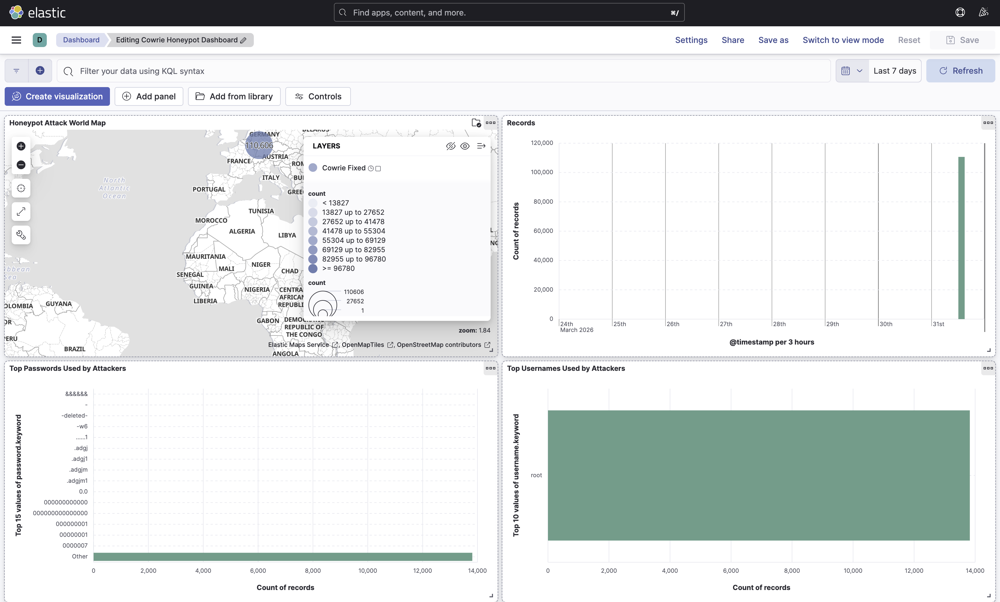

# 🍯 Cloud SSH Honeypot with ELK Stack


A production-grade SSH honeypot deployed on AWS EC2, capturing and analyzing **real-world brute-force attacks** in real-time using the ELK Stack (Elasticsearch, Logstash, Kibana).

---

## 📊 Real Attack Data — 7 Days Results

| Metric | Value |
|--------|-------|
| 🎯 Total Attacks Captured | **110,651** |
| 🌍 Top Attacking Country | **Germany (120,000+ attempts)** |
| 👤 Most Targeted Username | **root** |
| 🔑 Attack Type | SSH Brute Force |
| 🤖 Bot Detection | SSH-2.0-Go (Automated) |
| ⏱️ Avg Session Duration | **0.1 - 0.8 seconds** (pure bots) |

---

## 🏗️ Architecture

```
Internet (Attackers)
        │
        ▼
  AWS EC2 Instance
  (Elastic IP: Public)
        │
        ▼
  Cowrie SSH Honeypot
  (Port 2222)
        │
        ▼ cowrie.json logs
  Docker Network
  ┌─────┴──────┐
  │  Logstash  │ ← Parse + GeoIP Enrichment
  └─────┬──────┘
        │
        ▼
  Elasticsearch  ← Store 110k+ events
        │
        ▼
    Kibana  ← Real-time Dashboard
```

---

## 📸 Dashboard Screenshots

### 🗺️ Attack World Map + Timeline


### 🌍 Top Countries + IPs + Heatmap + SSH Versions


### ⏱️ Session Duration Analysis


---

## 🛠️ Tech Stack

| Component | Technology |
|-----------|-----------|
| **Cloud** | AWS EC2 (t2.micro), Elastic IP |
| **Honeypot** | Cowrie SSH Honeypot |
| **Log Pipeline** | Logstash + GeoIP Filter |
| **Database** | Elasticsearch |
| **Visualization** | Kibana |
| **Infrastructure** | Docker, Docker Compose |
| **OS** | Ubuntu 22.04 LTS |

---

## 📈 Kibana Dashboard Features

- 🗺️ **World Map** — Real-time attack origin visualization
- 📈 **Attack Timeline** — Hourly attack frequency
- 🔑 **Top Passwords** — Most used brute-force passwords
- 👤 **Top Usernames** — Most targeted usernames
- 🌍 **Top Attacking Countries** — Geographic threat analysis
- 🖥️ **Top Attacking IPs** — Individual attacker tracking
- 🌡️ **Attack Heatmap** — Country vs Time correlation
- 💻 **SSH Client Versions** — Bot vs human detection
- ⏱️ **Session Duration** — Attack behavior analysis

---

## 🚀 Setup Guide

### Prerequisites
- AWS Account
- Docker + Docker Compose installed
- Mac/Linux machine

### Step 1: AWS EC2 Setup
```bash
# Launch EC2 instance (Ubuntu 22.04, t2.micro)
# Assign Elastic IP
# Open ports: 22 (your IP only), 2222 (public), 5601 (your IP only)
```

### Step 2: Install Cowrie on EC2
```bash
# SSH into EC2
ssh -i your-key.pem ubuntu@YOUR_EC2_IP

# Install Cowrie
sudo apt update && sudo apt install -y python3-venv git
git clone https://github.com/cowrie/cowrie.git
cd cowrie
python3 -m venv cowrie-env
source cowrie-env/bin/activate
pip install -r requirements.txt

# Configure
cp etc/cowrie.cfg.dist etc/cowrie.cfg
# Edit cowrie.cfg: set listen_port = 2222

# Start
bin/cowrie start
```

### Step 3: ELK Stack with Docker (Local Machine)
```bash
# Clone this repo
git clone https://github.com/deep60/cloud-honeypot-elk.git
cd cloud-honeypot-elk

# Start ELK Stack
docker-compose up -d

# Verify containers
docker ps
```

### Step 4: Transfer Logs from EC2
```bash
# On EC2 - copy logs to local
scp -i your-key.pem ubuntu@YOUR_EC2_IP:~/cowrie/var/log/cowrie/cowrie.json* .
```

### Step 5: Kibana Setup
```
1. Open http://localhost:5601
2. Stack Management → Data Views → Create data view
   - Name: Cowrie Honeypot
   - Index pattern: cowrie-logs-*
   - Timestamp: @timestamp
3. Analytics → Dashboard → Import visualizations
```

---

## 🔍 Key Findings

### Attack Patterns
- **99%+ attacks are automated bots** (session duration < 1 second)
- `SSH-2.0-Go` — Most common bot signature (Go-based scanner)
- Attacks spike during **UTC business hours**

### Top Attacking Countries
1. 🇩🇪 Germany — 120,000+ (AWS Frankfurt scanners)
2. 🇺🇸 United States
3. 🇨🇳 China
4. 🇮🇳 India
5. 🇭🇰 Hong Kong

### Most Used Credentials
- **Username**: `root` (overwhelmingly dominant)
- **Passwords**: Sequential patterns, common defaults, symbol strings

---

## 📁 Project Structure

```
cloud-honeypot-elk/
├── docker-compose.yml      # ELK Stack configuration
├── logstash.conf           # Log parsing pipeline
├── .gitignore              # Excludes sensitive data
├── screenshots/            # Dashboard screenshots
│   ├── dashboard-1.png
│   ├── dashboard-2.png
│   └── dashboard-3.png
└── README.md
```

---

## ⚠️ Security Notes

- Cowrie logs (`cowrie.json`) are **NOT included** — contain real attacker IPs
- EC2 IP address not hardcoded
- SSH keys excluded via `.gitignore`
- This is a **research/educational** project

---

## 🎓 Skills Demonstrated

`Cloud Security` `AWS EC2` `SIEM` `Threat Intelligence` `Log Analysis`
`Docker` `Elasticsearch` `Kibana` `Network Security` `GeoIP Analysis`
`Incident Response` `Security Monitoring` `Data Visualization`

---

## 📬 Connect

Made with 🔥 by **Arjun**

[](https://github.com/deep60)
