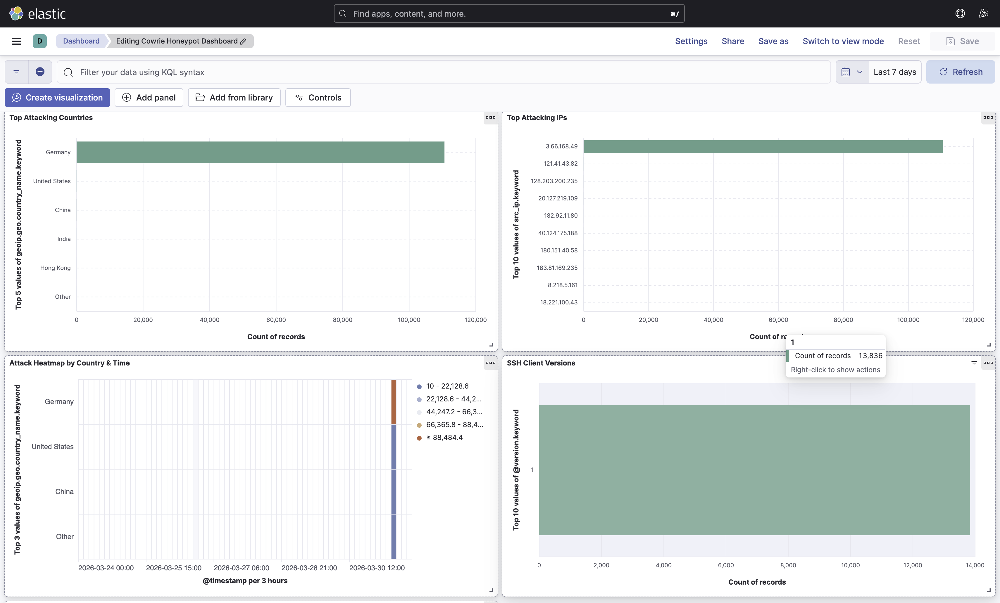
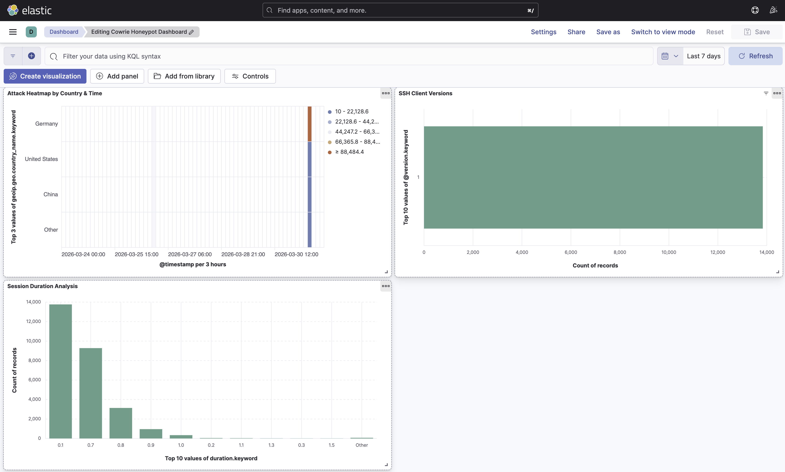

# 🍯 Cloud SSH Honeypot with Real-Time Threat Intelligence


A production-grade **Cloud Honeypot System** deployed on AWS that mimics real cloud infrastructure to attract, trap, and analyze real-world attackers. Every attacker interaction is silently recorded and analyzed — without them knowing.

> **Result**: 110,651+ real SSH attacks captured in 7 days. First attacker arrived within hours of deployment.

---

## 🎯 Project Overview

This honeypot creates a fake AWS environment that looks like a real misconfigured cloud setup — exposed EC2 instance, fake S3 bucket with "sensitive" files, and canary IAM credentials. When attackers interact with any of these resources, every action is logged, analyzed, and alerted on in real-time.

**What defenders learn from this:**
- Real-world attack patterns, tools, and techniques
- How quickly internet-exposed resources get attacked
- Attacker TTPs mapped to MITRE ATT&CK framework
- Bot vs human attacker differentiation

---

## 🏗️ Architecture

```
Internet (Attackers)
        │
        ▼
┌───────────────────────────────────┐
│         BAIT LAYER (AWS)          │
│  ┌─────────────┐ ┌─────────────┐  │
│  │  EC2 Server │ │  S3 Bucket  │  │
│  │  Port 22/80 │ │ Fake Creds  │  │
│  │  Cowrie SSH │ │ employee CSV│  │
│  └─────────────┘ └─────────────┘  │
│         ┌─────────────┐           │
│         │  IAM Canary │           │
│         │ admin-backup│           │
│         └─────────────┘           │
└───────────────────────────────────┘
        │
        ▼
┌───────────────────────────────────┐
│      LOGGING LAYER                │
│  Cowrie JSON → Logstash           │
│  CloudTrail → S3                  │
│  VPC Flow Logs                    │
└───────────────────────────────────┘
        │
        ▼
┌───────────────────────────────────┐
│      ANALYSIS LAYER               │
│  Elasticsearch + Kibana Dashboard │
│  110,651+ events indexed          │
└───────────────────────────────────┘
        │
        ▼
┌───────────────────────────────────┐
│      ALERT LAYER                  │
│  AWS SNS → Email Alerts           │
│  CloudWatch → Network Alarm       │
│  Lambda → Attacker Detail Emails  │
│  EventBridge → Canary Key Trigger │
└───────────────────────────────────┘
```

---

## 🧩 Deployed Components

| Component | Resource | Status |
|-----------|----------|--------|
| EC2 Honeypot | `corp-linux-server` (t2.micro) | ✅ Active |
| Cowrie SSH | Port 2222 (redirected from 22) | ✅ Running |
| S3 Fake Bucket | `corp-internal-backup-2024` | ✅ Active |
| IAM Canary User | `admin-backup-svc` | ✅ Active |
| CloudTrail | `honeypot-trail` (multi-region) | ✅ Logging |
| VPC Flow Logs | `fl-0ff0274b457a94a2d` | ✅ Active |
| SNS Topic | `honeypot-alerts` | ✅ Confirmed |
| CloudWatch Alarm | `honeypot-network-alert` | ✅ Enabled |
| Lambda Function | `honeypot-alert-function` | ✅ Deployed |
| EventBridge Rule | `honeypot-canary-key-alert` | ✅ Enabled |

---

## 📊 Real Attack Data — 7 Days Results

| Metric | Value |
|--------|-------|
| 🎯 Total Attacks Captured | **110,651** |
| 🌍 Top Attacking Country | **Germany (120,000+ attempts)** |
| 👤 Most Targeted Username | **`root`** |
| 🤖 Attacker Type | Automated Bot (`SSH-2.0-Go`) |
| ⏱️ Avg Session Duration | **0.1 – 0.8 seconds** |
| 🔥 Time to First Attack | **Within hours of deployment** |

---

## 🔍 Real Attacker Analysis

### Attacker Profile — IP: 3.66.168.49

| Parameter | Value |
|-----------|-------|
| Source IP | `3.66.168.49` |
| Location | Frankfurt am Main, Germany |
| ASN | AS16509 — Amazon.com, Inc. |
| Hostname | `ec2-3-66-168-49.eu-central-1.compute.amazonaws.com` |
| Infrastructure | AWS EC2 (eu-central-1) — hiding behind cloud |
| Attack Type | Automated SSH Brute Force Bot |
| Passwords Tried | `easynote`, `petunia`, `passeport` |
| Command Executed | `echo -e "\x6F\x6B"` (hex for 'ok' — liveness check) |
| Session Duration | 0.7 – 0.8 seconds per attempt |
| SSH Fingerprint | `SSH-2.0-Go` (Golang automated tool) |

### Attack Pattern Analysis

- **Rapid-fire connections** — 0.7-0.8s intervals, impossible for a human
- **Dictionary wordlist** — Specific password list (`easynote`, `petunia`, `passeport`)
- **Liveness check** — `echo -e "\x6F\x6B"` after every login to verify shell access
- **Cloud infrastructure abuse** — Using AWS EC2 to hide real origin IP
- **Golang bot** — `SSH-2.0-Go` fingerprint confirms automated scanner

---

## 🛡️ MITRE ATT&CK Framework Mapping

| Technique ID | Name | Observation |
|-------------|------|-------------|
| T1110.001 | Brute Force: Password Guessing | Dictionary attack on root user |
| T1078 | Valid Accounts | Attempted exploitation of default credentials |
| T1583.006 | Cloud Infrastructure | AWS EC2 used to launch attacks |
| T1033 | System Owner Discovery | `echo` command for server liveness check |
| T1071.004 | App Layer Protocol: SSH | SSH used for initial access attempt |

---

## 📸 Dashboard Screenshots

### 🗺️ Attack World Map + Timeline


### 🌍 Top Countries + IPs + Heatmap + SSH Client Versions


### ⏱️ Session Duration Analysis


---

## 📈 Kibana Dashboard Features

- 🗺️ **World Map** — Real-time attack origin visualization
- 📈 **Attack Timeline** — Hourly attack frequency graph
- 🔑 **Top Passwords** — Brute-force password pattern analysis
- 👤 **Top Usernames** — Most targeted usernames
- 🌍 **Top Attacking Countries** — Geographic threat intel
- 🖥️ **Top Attacking IPs** — Individual attacker tracking
- 🌡️ **Attack Heatmap** — Country vs Time correlation
- 💻 **SSH Client Versions** — Bot detection via fingerprinting
- ⏱️ **Session Duration** — Bot vs human behavior analysis

---

## 🛠️ Tech Stack

| Component | Technology |
|-----------|-----------|
| **Cloud** | AWS EC2, S3, CloudTrail, VPC Flow Logs |
| **Alerting** | AWS SNS, CloudWatch, Lambda, EventBridge |
| **Honeypot** | Cowrie SSH Honeypot |
| **Log Pipeline** | Logstash + GeoIP Filter |
| **Database** | Elasticsearch |
| **Visualization** | Kibana |
| **Infrastructure** | Docker, Docker Compose |
| **OS** | Ubuntu 22.04 LTS |

---

## 🚀 Setup Guide

### Prerequisites
- AWS Account with IAM permissions
- Docker + Docker Compose
- Mac/Linux machine

### Step 1: EC2 + Cowrie Setup
```bash
# Launch EC2 (Ubuntu 22.04, t2.micro), assign Elastic IP
# Security Group: Port 22 (your IP only), 2222 (public), 5601 (your IP only)

ssh -i your-key.pem ubuntu@YOUR_EC2_IP

# Install Cowrie
sudo apt update && sudo apt install -y python3-venv git
git clone https://github.com/cowrie/cowrie.git
cd cowrie && python3 -m venv cowrie-env
source cowrie-env/bin/activate
pip install -r requirements.txt

# Configure & start
cp etc/cowrie.cfg.dist etc/cowrie.cfg
bin/cowrie start
```

### Step 2: ELK Stack (Local Machine)
```bash
git clone https://github.com/deep60/cloud-honeypot-elk.git
cd cloud-honeypot-elk
docker-compose up -d
```

### Step 3: Transfer Logs from EC2
```bash
scp -i your-key.pem ubuntu@YOUR_EC2_IP:~/cowrie/var/log/cowrie/cowrie.json .
```

### Step 4: Kibana Setup
```
1. Open http://localhost:5601
2. Stack Management → Data Views → Create data view
   - Index pattern: cowrie-logs-*
   - Timestamp field: @timestamp
3. Analytics → Dashboard → Build visualizations
```

---

## 📁 Project Structure

```
cloud-honeypot-elk/
├── docker-compose.yml       # ELK Stack configuration
├── logstash.conf            # Log parsing + GeoIP enrichment pipeline
├── .gitignore               # Excludes sensitive data
├── screenshots/             # Dashboard screenshots
│   ├── dashboard-1.png
│   ├── dashboard-2.png
│   └── dashboard-3.png
└── README.md
```

---

## ⚠️ Security & Ethics

- Cowrie logs excluded from repo — contain real attacker PII
- EC2 IP not hardcoded anywhere
- SSH keys excluded via `.gitignore`
- IAM canary keys are **read-only + monitored** — cannot cause real damage
- Built for **research and educational purposes only**

---

## 🎓 Skills Demonstrated

`Cloud Security` `AWS EC2/S3/CloudTrail/Lambda/EventBridge` `SIEM`
`Threat Intelligence` `MITRE ATT&CK` `Log Analysis` `Docker`
`Elasticsearch` `Kibana` `Network Security` `GeoIP Analysis`
`Incident Response` `Security Monitoring` `Data Visualization`

---

[](https://github.com/deep60)
